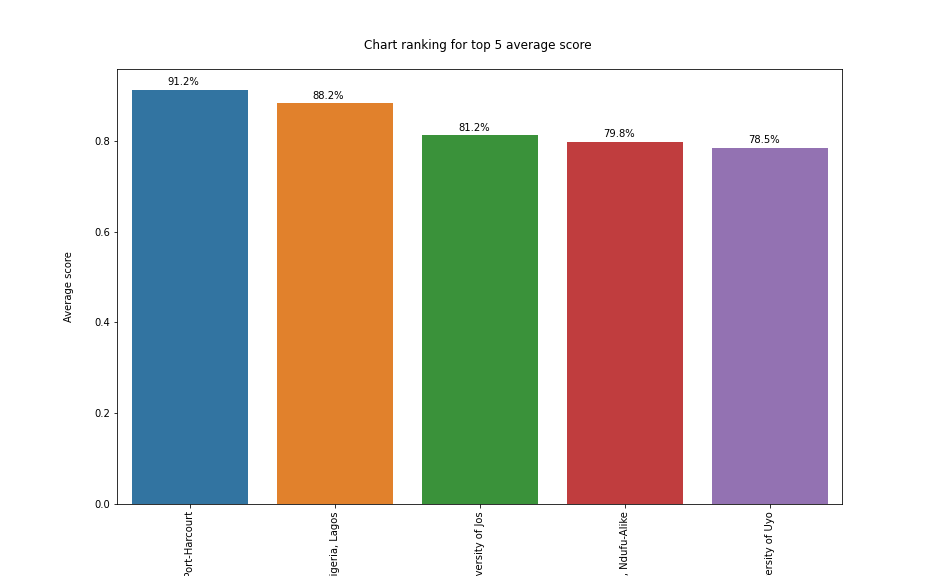

# fed-unis-perf-eval

The aim of this study is to evaluate the accessibility and performance of the official websites of the forty-nine (49) accredited Federal Universities in Nigeria by using the Google Lighthouse web auditing tool. The auditing is performed using [Google Lighthouse](https://developers.google.com/web/tools/lighthouse) and the [lighthouse-batch](https://github.com/mikestead/lighthouse-batch) open-source library. 

Kindly note the following:

- The generated report for each university is available in JSON, HTML, and CSV formats.
- The generated report for each university can be found in the `/lighthouse report/<university name>` directory.
- The generated summary report for each university can be found in the [`summary.json`](./summary.json) file (view the RAW format [here](https://fed-unis-perf-eval.netlify.app/summary.json)).
- The concluding report data for the research can be found in the [`summary.csv`](./summary.csv) file.

## Lighthouse Report

The table below lists out the universities evaluated and a link to view the generated HTML report which includes the website performance results, runtime configuration settings, errors found, reference links to learn more about each error, and Lighthouse recommended improvements.

| S/N | **University name**                               | **Link to full report**                                                                    |
|-----|---------------------------------------------------|--------------------------------------------------------------------------------------------|
| 01. | Abubakar Tafawa Balewa University                 | [click_here](https://fed-unis-perf-eval.netlify.app/report/Abubakar%20Tafawa%20Balewa%20University/atbu_edu_ng_.report.html)                         |
| 02. | Ahmadu Bello University                           | [click_here](https://fed-unis-perf-eval.netlify.app/report/Ahmadu%20Bello%20University/abu_edu_ng_.report.html)                                      |
| 03. | Air Force Institute of Technology                 | [click_here](https://fed-unis-perf-eval.netlify.app/report/Air%20Force%20Institute%20of%20Technology/afit_edu_.report.html)                          |
| 04. | Bayero University Kano                            | [click_here](https://fed-unis-perf-eval.netlify.app/report/Bayero%20University%20Kano/buk_edu_ng_.report.html)                                       |
| 05. | Federal University Birnin Kebbi                   | [click_here](https://fed-unis-perf-eval.netlify.app/report/Federal%20University%20Birnin%20Kebbi/fubk_edu_ng_.report.html)                           |
| 06. | Federal University Dustin-Ma                      | [click_here](https://fed-unis-perf-eval.netlify.app/report/Federal%20University%20Dustin-Ma/fudutsinma_edu_ng_.report.html)                          |
| 07. | Federal University Dutse                          | [click_here](https://fed-unis-perf-eval.netlify.app/report/Federal%20University%20Dutse/fud_edu_ng_.report.html)                                     |
| 08. | Federal University Gashua                         | [click_here](https://fed-unis-perf-eval.netlify.app/report/Federal%20University%20Gashua/fugashua_edu_ng_.report.html)                               |
| 09. | Federal University Gusau                          | [click_here](https://fed-unis-perf-eval.netlify.app/report/Federal%20University%20Gusau/fugusau_edu_ng_.report.html)                                 |
| 10. | Federal University Kashere                        | [click_here](https://fed-unis-perf-eval.netlify.app/report/Federal%20University%20Kashere/fukashere_edu_ng_.report.html)                             |
| 11. | Federal University Lafia                          | [click_here](https://fed-unis-perf-eval.netlify.app/report/Federal%20University%20Lafia/fulafia_edu_ng_.report.html)                                 |
| 12. | Federal University Lokoja                         | [click_here](https://fed-unis-perf-eval.netlify.app/report/Federal%20University%20Lokoja/fulokoja_edu_ng_.report.html)                               |
| 13. | Alex Ekwueme Federal University Ndifu-Alike                    | [click_here](https://fed-unis-perf-eval.netlify.app/report/Federal%20University%20Ndifu-Alike/funai_edu_ng_.report.html)                             |
| 14. | Federal University Otuoke                         | [click_here](https://fed-unis-perf-eval.netlify.app/report/Federal%20University%20Otuoke/fuotuoke_edu_ng_.report.html)                               |
| 15. | Federal University Oye-Ekiti                      | [click_here](https://fed-unis-perf-eval.netlify.app/report/Federal%20University%20Oye-Ekiti/fuoye_edu_ng_.report.html)                               |
| 16. | Federal University Wukari                         | [click_here](https://fed-unis-perf-eval.netlify.app/report/Federal%20University%20Wukari/fuwukari_edu_ng_.report.html)                               |
| 17. | Federal University of Agriculture Abeokuta        | [click_here](https://fed-unis-perf-eval.netlify.app/report/Federal%20University%20of%20Agriculture%20Abeokuta/unaab_edu_ng_.report.html)             |
| 18. | Federal University of Agriculture Makurdi         | [click_here](https://fed-unis-perf-eval.netlify.app/report/Federal%20University%20of%20Agriculture%20Makurdi/uam_edu_ng_.report.html)                |
| 19. | Federal University of Agriculture Zuru            | [click_here](https://fed-unis-perf-eval.netlify.app/report/Federal%20University%20of%20Agriculture%20Zuru/fuaz_edu_ng_.report.html)                  |
| 20. | Federal University of Health Technology Otukpo    | [click_here](https://fed-unis-perf-eval.netlify.app/report/Federal%20University%20of%20Health%20Technology%20Otukpo/fuhso_ng_.report.html)           |
| 21. | Federal University of Petroleum Resources Effurun | [click_here](https://fed-unis-perf-eval.netlify.app/report/Federal%20University%20of%20Petroleum%20Resources%20Effurun/fupreonline_com_.report.html) |
| 22. | Federal University of Technology Akure            | [click_here](https://fed-unis-perf-eval.netlify.app/report/Federal%20University%20of%20Technology%20Akure/futa_edu_ng_.report.html)                  |
| 23. | Federal University of Technology Minna            | [click_here](https://fed-unis-perf-eval.netlify.app/report/Federal%20University%20of%20Technology%20Minna/futminna_edu_ng_.report.html)              |
| 24. | Federal University of Technology Owerri           | [click_here](https://fed-unis-perf-eval.netlify.app/report/Federal%20University%20of%20Technology%20Owerri/futo_edu_ng_.report.html)                 |
| 25. | Michael Okpara University of Agricultural Umudike | [click_here](https://fed-unis-perf-eval.netlify.app/report/Michael%20Okpara%20University%20of%20Agricultural%20Umudike/mouau_edu_ng_.report.html)    |
| 26. | Modibbo Adama University of Technology            | [click_here](https://fed-unis-perf-eval.netlify.app/report/Modibbo%20Adama%20University%20of%20Technology/mautech_edu_ng_new_.report.html)           |
| 27. | National Open University of Nigeria               | [click_here](https://fed-unis-perf-eval.netlify.app/report/National%20Open%20University%20of%20Nigeria/nou_edu_ng_.report.html)                      |
| 28. | Nigeria Police Academy Wudil                      | [click_here](https://fed-unis-perf-eval.netlify.app/report/Nigeria%20Police%20Academy%20Wudil/polac_edu_ng_.report.html)                             |
| 29. | Nigerian Army University Biu                      | [click_here](https://fed-unis-perf-eval.netlify.app/report/Nigerian%20Army%20University%20Biu/naub_edu_ng_.report.html)                              |
| 30. | Nigerian Defence Academy                          | [click_here](https://fed-unis-perf-eval.netlify.app/report/Nigerian%20Defence%20Academy/nda_edu_ng_.report.html)                                     |
| 31. | Nigerian Maritime University                      | [click_here](https://fed-unis-perf-eval.netlify.app/report/Nigerian%20Maritime%20University/nmu_edu_ng_.report.html)                                 |
| 32. | Nnamdi Azikiwe University                         | [click_here](https://fed-unis-perf-eval.netlify.app/report/Nnamdi%20Azikiwe%20University/unizik_edu_ng_.report.html)                                 |
| 33. | Obafemi Awolowo University                        | [click_here](https://fed-unis-perf-eval.netlify.app/report/Obafemi%20Awolowo%20University/oauife_edu_ng_.report.html)                                |
| 34. | University of Abuja                               | [click_here](https://fed-unis-perf-eval.netlify.app/report/University%20of%20Abuja/uniabuja_edu_ng_.report.html)                                     |
| 35. | University of Benin                               | [click_here](https://fed-unis-perf-eval.netlify.app/report/University%20of%20Benin/uniben_edu_ng_.report.html)                                       |
| 36. | University of Calabar                             | [click_here](https://fed-unis-perf-eval.netlify.app/report/University%20of%20Calabar/unical_com_.report.html)                                        |
| 37. | University of Ibadan                              | [click_here](https://fed-unis-perf-eval.netlify.app/report/University%20of%20Ibadan/ui_edu_ng_.report.html)                                          |
| 38. | University of Ilorin                              | [click_here](https://fed-unis-perf-eval.netlify.app/report/University%20of%20Ilorin/www_unilorin_edu_ng_.report.html)                                |
| 39. | University of Jos                                 | [click_here](https://fed-unis-perf-eval.netlify.app/report/University%20of%20Jos/unijos_edu_ng_.report.html)                                         |
| 40. | University of Lagos                               | [click_here](https://fed-unis-perf-eval.netlify.app/report/University%20of%20Lagos/unilag_edu_ng_.report.html)                                       |
| 41. | University of Maiduguri                           | [click_here](https://fed-unis-perf-eval.netlify.app/report/University%20of%20Maiduguri/unimaid_edu_ng_.report.html)                                  |
| 42. | University of Nigeria Nsukka                      | [click_here](https://fed-unis-perf-eval.netlify.app/report/University%20of%20Nigeria%20Nsukka/unn_edu_ng_.report.html)                               |
| 43. | University of Port-Harcourt                       | [click_here](https://fed-unis-perf-eval.netlify.app/report/University%20of%20Port-Harcourt/uniport_edu_ng_.report.html)                              |
| 44. | University of Uyo                                 | [click_here](https://fed-unis-perf-eval.netlify.app/report/University%20of%20Uyo/uniuyo_edu_ng_.report.html)                                         |
| 45. | Usman Danfodiyo University                        | [click_here](https://fed-unis-perf-eval.netlify.app/report/Usman%20Danfodiyo%20University/udusok_edu_ng_.report.html)                                |

## Results and Findings

The aggregated results for each metric obtained from Google Lighthouse are visualized using histogram graphs as seen in [this document](https://fed-unis-perf-eval.netlify.app/data/results.pdf). Out of the 45 universities evaluated, the table below gives the summary of the results for the four (4) metrics – performance, accessibility, best practices and search engine optimization (SEO), presenting the number of universities that scored less than 50% (poor score), greater than 50% (needs-improvement score) and greater than 90% (Good score). 

| **Metrics**       | **No of Universities with Poor score (<50%)** | **No of Universities with Needs-improvement score (>50%)** | **No of Universities with Good score (>90%)** |
|-------------------|-----------------------------------------------|------------------------------------------------------------|-----------------------------------------------|
| Performance       |                       40                      |                              5                             |                       1                       |
| Accessibility     |                       9                       |                             36                             |                       15                      |
| Best Practices    |                       22                      |                             23                             |                       3                       |
| SEO               |                       7                       |                             38                             |                       5                       |

 

In addition, here are some graphs for the top five (5) universities for each metric:

> The top 5 Universities with the highest Performance score

> The top 5 Universities with the highest Accessibility score

> The top 5 Universities with the highest Best-practices score

> The top 5 Universities with the highest SEO score

> The top 5 Universities with the highest aggregated average score
